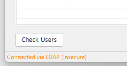
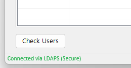

# AD User Status
A simple PowerShell-based utility that imports a list of usernames from an Excel ```(.xlsx)``` file and performs LDAP queries to determine their status in Active Directory. This tool is helpful for user audits, licensing reclaiming, onboarding/offboarding reviews, and general access verification.

## 📑 Table of Contents
- [Introduction](#-introduction)
- [Features](#-features)
- [Quick Usage](#-quick-usage)
- [Supported Operating Systems](#-supported-operating-systems)
- [Prerequisites](#%EF%B8%8F-prerequisites)
- [Noteworthy Code Snippets](#-noteworthy-code-snippets)
- [Future Development](#-future-development)
- [Acknowledgements](#-acknowledgements)
- [License](#-license)
- [Author](#-author)

## 🧾 Introduction
I’m **not a developer** by any stretch of the imagination. I work in the **cyber security** field, and this tool started out as a simple **pet project**.

It came about after a colleague needed a way to periodically review the status of **Active Directory user accounts** pulled from a line-of-business platform. The goal? Reclaim licenses from disabled accounts.

I originally began writing a basic PowerShell script for the task... but then thought, *why not have some fun with it?* So I turned to **ChatGPT** to see how far I could take it — and this tool is the result.

I hadn’t really used any AI platforms before this, so this was a bit of an experiment — both to build something useful and to see what was possible with a bit of curiosity (and some help from an AI). It turned out to be a fun and surprisingly productive experience.

[🔝 Back to top](#ad-user-status)

## 📋 Features
- Import users from Excel file (.xlsx)
- Query Active Directory using LDAP
- Categorize users as:
  +  Active Accounts – Account is enabled in AD
  +  Disabled Accounts – Account exists but is disabled
  +  Accounts Not Found – Not found in AD *(disabled account should be removed from AD after a period)*
  +  External Accounts – Detected as an external UPN suffix
- Clear output display (console or exportable)
- Ideal for IT admins and audit teams

[🔝 Back to top](#ad-user-status)

## ⚡ Quick Usage
This application is a standalone .exe, generated from a PowerShell script using [PS2EXE](https://github.com/MScholtes/PS2EXE). You're welcome to open PowerShell if you like, but there's no need to run any .ps1 files — just launch the .exe directly.
> For transparency and customization, the original PowerShell .ps1 [source code](./AD%20User%20Status.ps1) is included in the repository. Feel free to review, modify, or extend it to suit your environment.
1. **Prepare your Excel file**
   - Ensure it contains the three columns **Internal ID**, **Name** & **Email** in the order seen below.
    \
   <sup>**Note:** If you don't have an **Internal ID**, just use any random number — they can all be the same. See Future Development Ideas; I have plans to mature this component.</sup>
   - Save the file with a .xlsx extension.
2. **Run the application**
   - **Option 1**: Double-click the .exe file, or run it via command line: ```ADUserChecker.exe``` 
   - **Option 2**: Alternatively, launch the Powershell .ps1 script using the regular PowerShell terminal or PowerShell ISE: ```.\Check-ADUsers.ps1```
      > 🛠️ Both methods work — use whichever fits your workflow. The .exe is great for convenience, while the .ps1 is available for transparency, debugging, or further customization.
4. **Follow the prompts**
   - Select browse and navigate to your .xlsx file.
   - Select **Check Users**, users will be processed and categorized under one of the following tabs:
     +  Active Accounts
     +  Disabled Accounts
     +  Accounts Not Found
     +  External Accounts
> 💡 No PowerShell knowledge required — just run, import, review and export the results.

[🔝 Back to top](#ad-user-status)

## 💻 Supported Operating Systems
The application has been tested and confirmed working on:
- Windows 10
- Windows 11
- Windows Server 2016 or later
> ⚠️ It may work on other systems, but only the above have been tested.

[🔝 Back to top](#ad-user-status)

## 🛠️ Prerequisites
- PowerShell 5.1+ or PowerShell Core
- .NET Framework 4.6.2 or later
- .NET 6.0, .NET 7.0, .NET 8.0, .NET 9.0.
> 🔍 Note: I've intentionally choosen not to use the built-in Active Directory PowerShell cmdlets (like Get-ADUser) due to their relatively slow performance in large queries. Instead, it leverages direct LDAP queries for faster and more efficient user lookups. The script first attempts to connect using LDAPS (secure LDAP over SSL) however If LDAPS is unavailable, it will fail-back to standard LDAP.

[🔝 Back to top](#ad-user-status)

## 💻 Noteworthy Code Snippets
🔐 **LDAPS First, LDAP Fallback**
The script first attempts to connect to Active Directory using LDAPS (port 636) and perform a secure query however If LDAPS is unavailable (due to firewall, network issues or misconfiged domain settings), it gracefully fails back to standard LDAP (port 389) which is displayed in the bottom left corner of the application window.
```
function Test-LDAPSConnection {
    param (
        [string]$adServer
    )
    try {
        # Define the LDAP server with LDAPS port (636)
        $ldapIdentifier = "$adServer:636"
        $ldapConnection = New-Object System.DirectoryServices.Protocols.LdapConnection($ldapIdentifier)
        
        # Use SSL
        $ldapConnection.SessionOptions.SecureSocketLayer = $true
        $ldapConnection.SessionOptions.VerifyServerCertificate = {
            param ($conn, $cert)
            return $true  # You can add stricter certificate validation here if needed
        }

        # Attempt a bind using the current credentials
        $ldapConnection.AuthType = [System.DirectoryServices.Protocols.AuthType]::Negotiate
        $ldapConnection.Bind()  # Throws an exception if the connection fails

        # Perform a basic LDAP search to confirm server responds to queries
        $searchRequest = New-Object System.DirectoryServices.Protocols.SearchRequest(
            "",  # Base DN (empty means the rootDSE)
            "(objectClass=*)",  # Simple filter to return all objects
            [System.DirectoryServices.Protocols.SearchScope]::Base,  # Only the rootDSE
            @("defaultNamingContext")  # Attributes to return
        )

        $searchResponse = $ldapConnection.SendRequest($searchRequest)

        # If the response has entries, LDAPS is working fully
        if ($searchResponse.Entries.Count -gt 0) {
            $ldapConnection.Dispose()
            return $true
        } else {
            $ldapConnection.Dispose()
            return $false
        }
    }
    catch {
        # LDAPS failed (either connection error, bind failure, or query failure)
        return $false
    }
}
```
<div align="center">
  
  &nbsp;&nbsp;&nbsp;&nbsp;&nbsp;&nbsp;&nbsp;&nbsp;&nbsp;&nbsp;&nbsp;&nbsp;
  
</div>

This dual-path approach prioritizes secure communication by attempting LDAPS first, while maintaining compatibility by gracefully falling back to standard LDAP if necessary.

[🔝 Back to top](#ad-user-status)

## 🧠 Future Development
Here are some enhancement ideas I’m considering for future versions of the tool:
- Allow user selection of which columns to import and process from the provided .xlsx file.
- Improve the FAQ/help window for better clarity and usability.
- Introduce a retry button for when a Domain Controller cannot be found.
- Auto-generate a placeholder Internal ID if one is not provided.
- Display summary statistics (e.g., number of active, disabled, external accounts).
- Auto-check for newer version or release tag on GitHub.

[🔝 Back to top](#ad-user-status)

## 🙏 Acknowledgements
- Icons and visual assets used in this application were sourced from [Freepik](https://www.freepik.com). 
- The executable version of the application was compiled from our PowerShell script [using PS2EXE by Ingo Karstein & Markus Scholtes](https://github.com/MScholtes/PS2EXE)
- This project was built with assistance of [ChatGPT](https://openai.com/chatgpt) to provide some of the Powershell code based on requirements put forward.

[🔝 Back to top](#ad-user-status)

## 📝 License
CC0 1.0 Universal
https://creativecommons.org/publicdomain/zero/1.0/

This project is released into the public domain — free for use, modification, and distribution.

[🔝 Back to top](#ad-user-status)

## 🧙 Author
**Webbie003**
🔗 https://github.com/webbie003

[🔝 Back to top](#ad-user-status)
